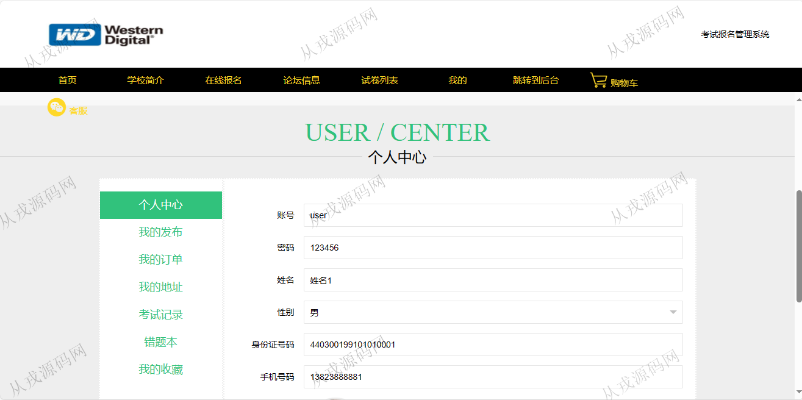

<h1 align="center">160.考试报名管理系统</h1>

 获取sql文件 QQ: 386869957 QQ群: 377586148 

 [更多源码项目: 从戎源码网](https://armycodes.com/) 

## 简介

> 本代码来源于网络,仅供学习参考使用!
>
> 提供1.远程部署/2.修改代码/3.设计文档指导/4.框架代码讲解等服务
> 
> 用户端访问地址：http://localhost:8080/jspm974gz/front/pages/login/login.jsp
> 
> 用户：user 123456
> 
> 管理后台访问地址：http://localhost:8080/jspm974gz/jsp/login.jsp
> 
> 管理员：admin 123456
>

## 项目介绍
基于ssm的考试报名管理系统：前端 jsp、jquery、bootstrap，后端 maven、springmvc、spring、mybatis；角色分为管理员、用户；集成在线报名，试卷列表，论坛信息等功能于一体的系统。

## 功能介绍

### 用户前端

- 基本功能：登录、注册，退出
- 网站首页：主导航栏，轮播图，学校简介展示，在线报名展示
- 学校简介：学校简介信息列表展示，学校简介页面，收藏，赞一下，踩一下
- 在线报名：报名项目列表展示，报名项目详情，购物车，在线结算
- 论坛信息：论坛信息列表，发布帖子
- 试卷列表：试卷列表查询，在线考试
- 我的：个人信息查询与修改，我的发布，我的订单，我的地址，考试记录，错题本，我的收藏

### 管理后台

- 用户管理：用户信息的增删改查，批量删除，用户信息可以由用户前台自行注册
- 学校简介管理：简介信息的增删改查，图片上传
- 在线报名管理：报名项目的增删改查，按报考项目名称搜索查询
- 试卷管理：试卷信息的增删改查
- 试题管理：试题信息的增删改查
- 论坛管理：论坛信息的增删改查
- 订单管理：订单信息的列表查询
- 考试管理：试卷列表，考试记录，错题本

## 环境

- <b>IntelliJ IDEA 20021.3</b>

- <b>Mysql 5.7.26</b>

- <b>Tomcat 7.0.73</b>

- <b>JDK 1.8</b>

## 运行截图

